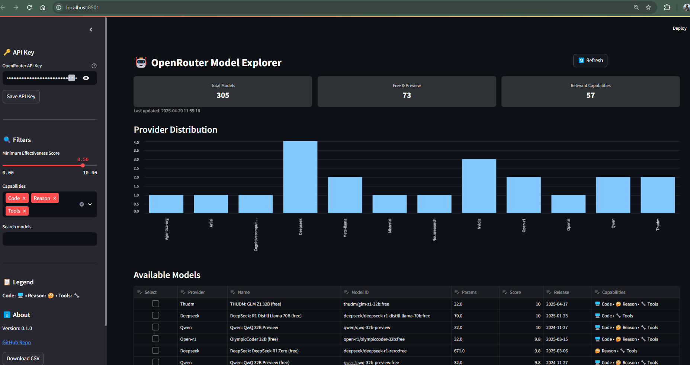

# OpenRouter Model Explorer


A powerful, interactive dashboard to discover, compare, and select the best free and preview AI models available on OpenRouter. Focused on models with coding, reasoning, and tool-calling capabilities.

## 🌟 Features

- **Interactive Filtering**: Filter models by effectiveness score, specific capabilities, and text search
- **Provider Information**: See which company created each model (Anthropic, Google, Meta, etc.)
- **Effectiveness Scoring**: Models ranked by a calculated score (0-10) based on:
  - Context length
  - Parameter size
  - Special capabilities
  - Function/tool support
- **Capability Visualization**: Clear indicators for coding, reasoning, and tool-calling support
- **One-Click Exporting**: Select models and export them as environment variables for your projects

## 📊 Screenshots



## 🚀 Getting Started

### Prerequisites

- Python 3.10 or higher
- pip (included with Python)
- An OpenRouter API key ([Get one here](https://openrouter.ai/keys))

### Automated Setup (Recommended)

1. Clone this repository
2. Run the appropriate script for your operating system:

   - Windows:
     ```
     .\run.ps1
     ```
   
   - macOS/Linux:
     ```
     chmod +x run.sh
     ./run.sh
     ```

This will automatically:
- Create a virtual environment (`.venv`)
- Install all required dependencies
- Start the Streamlit application

### Manual Setup

If you prefer to run commands yourself without the helper scripts:

1. Clone this repository
2. Install uv (if not already installed):
   ```bash
   pip install uv
   ```
3. Create a virtual environment:
   ```bash
   uv venv .venv --seed
   ```
4. Install dependencies:
   ```bash
   uv pip install -e .
   ```
5. Run the application:
   ```bash
   uv run --project . --module streamlit run app.py
   ```

## Configuration

Create a `.env` file in the root directory with your OpenRouter API key:
```
OPENROUTER_API_KEY=your_api_key_here
```

You can get an API key from [OpenRouter.ai](https://openrouter.ai/).

## 📋 How It Works

The tool connects to OpenRouter's API to fetch comprehensive model data, then:

1. Filters for free and preview models
2. Calculates an effectiveness score (0-10) based on multiple factors
3. Analyzes model descriptions and architecture to identify capabilities
4. Extracts provider information from model IDs
5. Presents results in an interactive table with filtering options

## 🔍 Features Explained

### Effectiveness Score

The effectiveness score (0-10) considers:

- **Context Length**: +1 for >32k tokens, +0.5 for >16k tokens
- **Tool/Function Support**: +1 for tool/function calling capabilities
- **Preview Models**: +0.5 for preview models
- **Model Size**: +1.5 for ≥70B, +1 for ≥30B, +0.5 for ≥7B
- **Specialties**: +1 for models with both coding and reasoning, +1 for tool calling
- **Recency**: +0.5 if released in the last 30 days, +0.25 if within the last year
- **Quantization Penalty**: –0.5 for quantized variants (q4_, int4, int8, etc.)
- **Family Bonus**: +0.5 for recognized strong model families (Mistral, LLaMA, Falcon, GPT)
- **Multimodal**: +0.5 for models supporting vision, image, audio, or multimodal capabilities

### Capabilities

Models are analyzed for specific capabilities:

- **🖥️ Code**: Specialized in coding tasks and programming
- **🤔 Reason**: Strong reasoning and logical thinking abilities
- **🔧 Tools**: Support for tool use and function calling

## 🤝 Contributing

Contributions are welcome! Feel free to:

- Report bugs
- Suggest features
- Submit pull requests

## 📝 License

This project is MIT licensed. See LICENSE file for details.

## 🙏 Acknowledgements

- [OpenRouter](https://openrouter.ai/) for providing API access to multiple LLMs
- [Streamlit](https://streamlit.io/) for the interactive web framework
- Contributors and users who provide feedback
